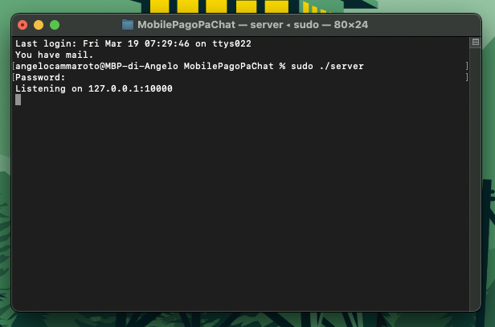
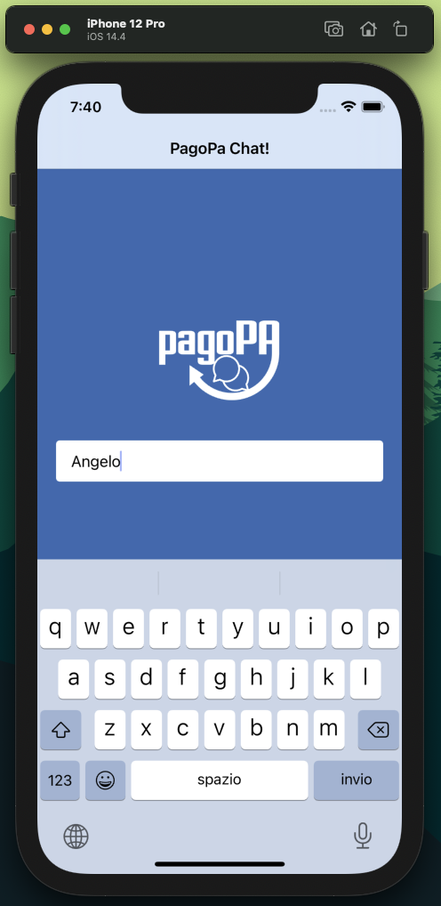
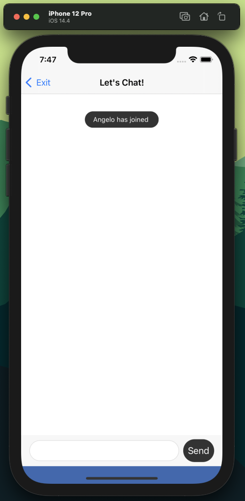
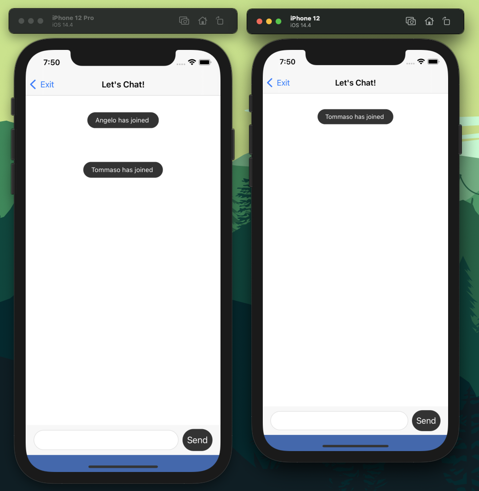
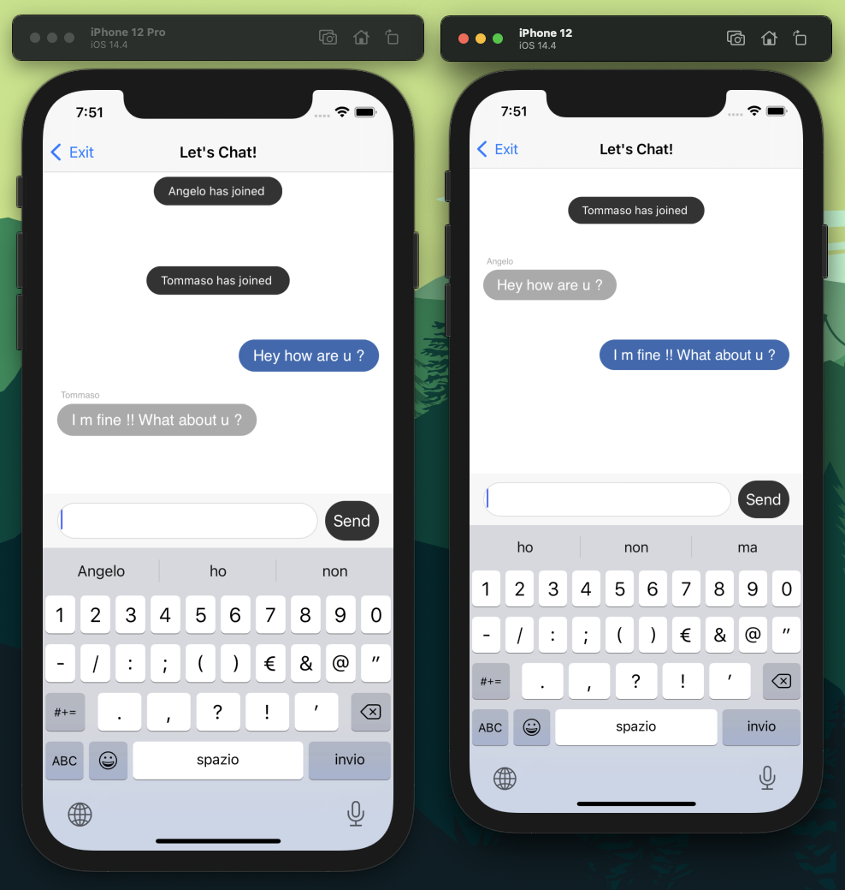
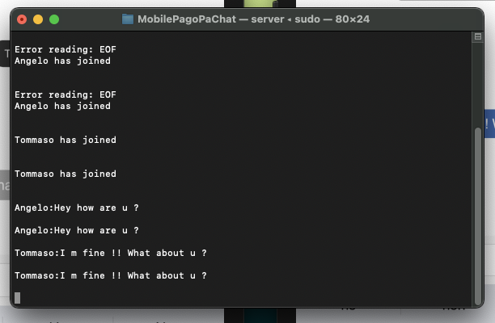
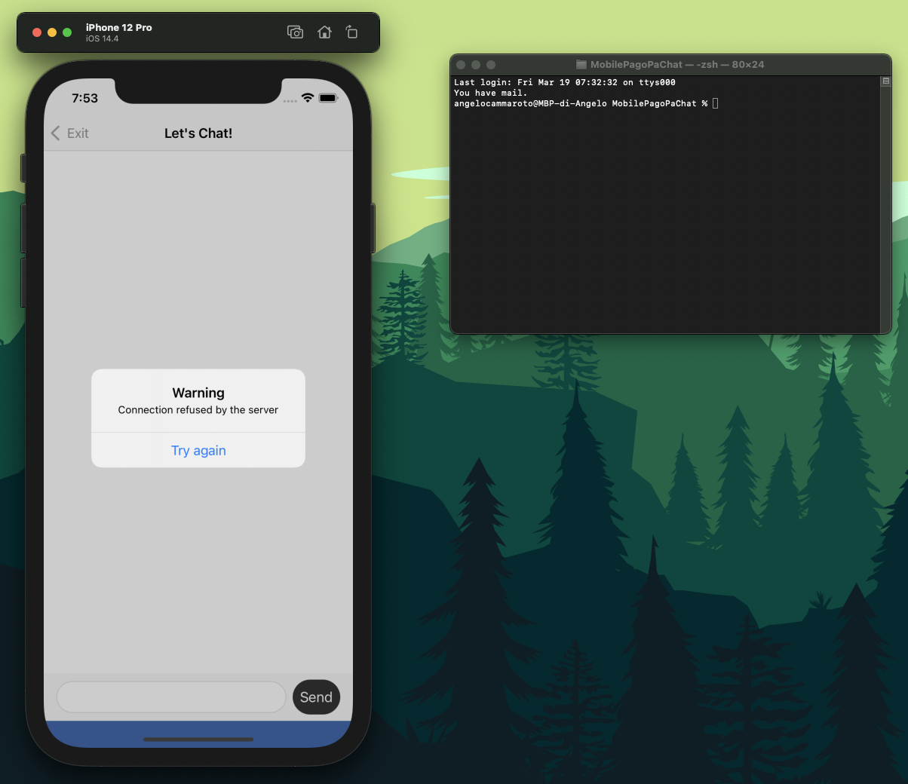

# **PagoPa Mobile Chat**

# **Exercise requirements**

Write a very simple chat server that should listen on TCP port 10000 for clients. The chat protocol is very simple, clients connect with "telnet" and write single lines of text. On each new line of text, the server will broadcast that line to all other connected clients.


# **Let's start with the Server**

The server uses Go you can find both the precompiled server and the source code to personalize the server and compile it.

To run the pre-compiled server, open Terminal, navigate to the starter materials directory and enter this command:

``` 
sudo ./server 
```

When the prompt appears, enter your password. After putting in, you should see: ***Listening on 127.0.0.1:10000***

<p align="center">
  
</p>

## **How to compile server**

If you want to compile the server yourself, you’ll need to install Go with Homebrew.

If you don’t have Homebrew either, then you’ll have to install it before you can start. Open Terminal and paste in the following line:

``` 
/usr/bin/ruby -e \
  "$(curl -fsSL https://raw.githubusercontent.com/Homebrew/install/master/install)" 
```

Then, use this command to install Go:

``` 
brew install go 
```

Once that’s finished, navigate to the directory of the starter materials and build the server with build.

```
go build server.go 
```

Finally, you can start your server using the command listed at the start of this section.


# **Let's talk about the client app**

## **Create a chat room**

To get started on the actual coding, navigate to ***ChatRoomViewController.swift***.  This view controller is ready and able to receive strings from an input bar. It can also display messages using a table view with custom cells configured with ``` Message```  objects.


Since the goal is also develop a good and solid code, it's a good practive to separate duties and apply the king of iOS design patter: **Model View Controller**.


We already have a ```ChatRoomViewController```, it makes sense to create a ```ChatRoom``` model class to take care of the heavy lifting.

Duties of ChatRoom are:

- Open a connection to the chat room server.
- Allow a user to join the chat room by providing a username.
- Allow a user to send and receive messages.
- Close the connection when we’re done.

In this class you can also find the properties we need to open a connection and communicate with the server:

- Input and Output streams. Using this pair of classes together allow us to create a socket-based connection between the app and the chat server. 
- Username, where we store the name of the current user.
- MaxReadLength to puts a cap on how much data we can send in any single message.

```swift
import UIKit

class ChatRoom: NSObject {

  var inputStream: InputStream!
  var outputStream: OutputStream!

  var username = ""

  let maxReadLength = 4096
}
```

## **Opening a Connection**

Using the following method we can open a conncetion with the server. 
```swift
func setupNetworkCommunication() {
  
  var readStream: Unmanaged<CFReadStream>?
  var writeStream: Unmanaged<CFWriteStream>?

  let serverAddress: CFString = "localhost" as CFString
  let port: UInt32 = 10000

  CFStreamCreatePairWithSocketToHost(kCFAllocatorDefault,
                                     serverAddress,
                                     port,
                                     &readStream,
                                     &writeStream)
}
```

Here’s what’s happening:

- We set up two uninitialized socket streams without automatic memory management.
- Then we bind our read and write socket streams together and connect them to the socket of the host, which is on port 10000 in this case.
  
The function takes four arguments. The first is the type of **allocator** we want to use when initializing your streams. I used ```kCFAllocatorDefault``` whenever possible, though there are other options if you run into a situation where you need something that acts a little differently.

Next, we have to specify the hostname (server address) and the port the server listens on.

Finally, we pass in the pointers to your read and write streams so the function can initialize them with the connected read and write streams that it creates internally.

Now that the streams are initialized, we can store retained references to them by adding the following lines at the end of ```setupNetworkCommunication()```:

```swift
inputStream = readStream!.takeRetainedValue()
outputStream = writeStream!.takeRetainedValue()
```

## **The communication Protocol**

One advantage of dropping down to the TCP level is that we can define our own “protocol” for deciding whether a message is valid or not.

With HTTP, we need to think about all those pesky verbs like GET, PUT, and PATCH. We need to construct URLs and use the appropriate headers and all kinds of stuff.

Here we just have two kinds of messages. You can send:
```
iam:Luke
```
to enter the room and inform the world of your name.

And we can say:
```
msg:Hey, how goes it, man?
```
to send a message to everyone else in the room.

This is simple but also blatantly insecure 🤓

So to join in the chat we have to send the first type of message:
```swift
func joinChat(username: String) {
  
  let data = "iam:\(username)".data(using: .utf8)!
  
  self.username = username

  _ = data.withUnsafeBytes {
    guard let pointer = $0.baseAddress?.assumingMemoryBound(to: UInt8.self) else {
      print("Error joining chat")
      return
    }

    outputStream.write(pointer, maxLength: data.count)
  }
}
```

- First, we construct our message using the simple chat room protocol.
- Then, we save the name so we can use it to send chat messages later.
- ```withUnsafeBytes(_:)``` provides a convenient way to work with an unsafe pointer version of some data within the safe confines of a closure.
- Finally, we write our message to the output stream. This may look a little more complex than we assumed, but ```write(_:maxLength:)``` takes a reference to an unsafe pointer to bytes as its first argument, which we created in the previous step.





## **Reacting to Incoming Messages**


The server sends incoming messages like the join message you just sent to everyone in the room, including you. As fortune would have it, the app is already set up to show any type of incoming message as a cell in the ChatRoomViewController‘s table of messages.

In order to react to incoming messages, we have to add the following extension and, to be conform to the StreamDelegate, we have to setup properly our input and output stream.
```swift
extension ChatRoom: StreamDelegate {
}
```

```swift
inputStream.delegate = self
```
Next, we have to add this implementation of stream(_:handle:) to the extension to properly manage every type of events (including the KO connection status):
```swift
 func stream(_ aStream: Stream, handle eventCode: Stream.Event) {
        switch eventCode {
        case .openCompleted:
            delegate?.didConnectionOK()
        case .hasBytesAvailable:
            print("new message received")
            readAvailableBytes(stream: aStream as! InputStream)
        case .endEncountered:
            print("new message received")
            stopChatSession()
        case .errorOccurred:
            print("error occurred")
            delegate?.didConnectionFailsWithError(error: "error")
        case .hasSpaceAvailable:
            print("has space available")
        default:
            print("some other event...")
        }
    }
```


## **Creating the ChatRoomDelegate Protocol**


To tell to the ChatRoomViewController.swift about new messages and status changes and avoid circular dependency we can use again protocols and delegate.

At the top of ChatRoom.swift we can define a simple protocol definition:
```swift

protocol ChatRoomDelegate: class {
    func received(message: Message)
    func didConnectionFailsWithError(error: String)
    func didConnectionOK()
}

```

On ChatRoomViewController.swift we add the following extension, which conforms to this protocol: 

```swift
//MARK: - ChatRoomDelegate
extension ChatRoomViewController: ChatRoomDelegate {
    func didConnectionOK() {
    }
    
    func didConnectionFailsWithError(error: String) {
        let alert = UIAlertController(title: "Warning", message: "Connection refused by the server", preferredStyle: UIAlertController.Style.alert)
        alert.addAction(UIAlertAction(title: "Try again", style: UIAlertAction.Style.default, handler: {_ in
            self.navigationController?.popViewController(animated: true)
        }))
        self.present(alert, animated: true, completion: nil)
    }
    
    func received(message: Message) {
        insertNewMessageCell(message)
    }
}
```

<p align="center">
  
</p>

🎉 The chat room now successfully shows a cell stating that you've entered the room. We've officially sent a message to and received a message from a socket-based TCP server.

## **Sending Messages**


To send and receive messages, we can use the following method declared in the ChatRoom.swift

```swift
func send(message: String) {
  let data = "msg:\(message)".data(using: .utf8)!

  _ = data.withUnsafeBytes {
    guard let pointer = $0.baseAddress?.assumingMemoryBound(to: UInt8.self) else {
      print("Error joining chat")
      return
    }
    outputStream.write(pointer, maxLength: data.count)
  }
}
```

This method is just like joinChat(username:), which I wrote earlier, except that it prepends msg to the text you send to denote it as an actual message.


<p align="center">
  
</p>


<p align="center">
  
</p>


## **Handle Connection Error Properly**


To tell to our ChatRoomViewController.swift there is something wrong, in particular the server is unreachable or there are some problems on the I/O streams we can use the ```didConnectionFailsWithError``` function described in the ChatRoomDelegate protocol:

```swift

protocol ChatRoomDelegate: class {
    func received(message: Message)
    func didConnectionFailsWithError(error: String)
    func didConnectionOK()
}

```

To be compliant to the class protocol we have to handle and implement that function also in our ChatRoomViewController.swift extension:

```swift
//MARK: - ChatRoomDelegate
extension ChatRoomViewController: ChatRoomDelegate {
    func didConnectionOK() {
    }
    
    func didConnectionFailsWithError(error: String) {
        let alert = UIAlertController(title: "Warning", message: "Connection refused by the server", preferredStyle: UIAlertController.Style.alert)
        alert.addAction(UIAlertAction(title: "Try again", style: UIAlertAction.Style.default, handler: {_ in
            self.navigationController?.popViewController(animated: true)
        }))
        self.present(alert, animated: true, completion: nil)
    }
    
    func received(message: Message) {
        insertNewMessageCell(message)
    }
}
```
In this way every time the streams will get an error the ChatRoomController.swift will be able to recieve this error from the ChatRoom and handle it in the proper way. 

<p align="center">
  
</p>

## **Cleaning up After Yourself**


To be a good citizens, when we open a socket connection you should close it when we're done, just as we would with files or similar things.
To do it, in ChatRoom.swift we use the following method:


```swift
func stopChatSession() {
  inputStream.close()
  outputStream.close()
}
```
<br>

# **How to improve the app 👨‍💻**
There are several way to improve the app and make the code SOLID and CLEAN. One of them could be implements our error class that basically collect all the error we want to handle and use it inside the  ``` didConnectionFailsWithError(error: String) ``` instead of the simple ``` String ``` class. 
